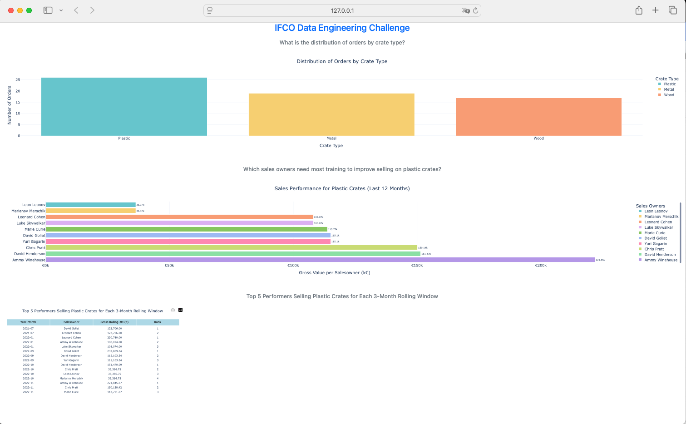

# Data Engineering Test Solution

This project contains solutions for a Data Engineering test, focusing on various data processing tasks using Python. Each task involves data cleaning, validation, analysis, and output generation. The solutions are modular and documented to facilitate readability and maintainability.

## Project Structure

The project is organized into the following directories:

- `data/`: Contains input data files (`orders.csv`, `invoicing_data.json`).
- `output/`: Stores the processed output files.
- `scripts/`: Includes Python scripts for data processing.
- `notebooks/`: Contains Jupyter Notebooks for exploratory analysis and testing.
- `tests/`: Holds unit tests for the scripts.

Here is the directory tree for better visualization:

```
/data-engineering-test
├── data/
│   ├── orders.csv
│   └── invoicing_data.json
├── output/
├── scripts/
│   ├── data_downloader.py
│   ├── calculate_crate_distribution.py
│   ├── calculate_contact_fullname.py
│   ├── contact_address_processing.py
│   └── calculate_commissions.py
    └──company_salesowners.py
├── notebooks/
│   ├── exercise_1.ipynb
├── tests/
│   ├── test_data_downloader.py
│   ├── test_calculate_crate_distribution.py
│   ├── test_calculate_contact_fullname.py
│   ├── test_contact_address_processing.py
│   └── test_calculate_commissions.py
    └── test_company_salesowners.py
├── requirements.txt
└── README.md
```

## Requirements

- Python 3.11.5
- Required libraries are listed in `requirements.txt`.

To install the necessary libraries, run:

```bash
pip install -r requirements.txt
```

## Automated Workflow with Docker

The Docker container provides an end-to-end automated workflow for data download, processing, testing, and dashboard deployment.

When you start the container, it performs the following steps automatically:

1.	Data Download: Fetches orders.csv and invoicing_data.json from specified URLs and saves them in /data.
2.	Data Processing: Each Python script processes the data and generates output files in /output.
3.	Testing: Each script is validated with unit tests to ensure functionality.
4.	Dashboard Launch: A Dash application visualizes the data insights and is accessible at http://0.0.0.0:8050.

### **Step-by-Step Guide to Running the Container**

1. **Build the Docker Image:**

```bash
docker build -t data-engineering-dashboard .
```

2.	**Run the Docker Container:**

```bash
docker run -p 8050:8050 data-engineering-dashboard
```
3.	**Access the Dashboard:**

Open a web browser and go to http://localhost:8050 in a web browser.

*Note:* Output files are saved in the /output directory within the container, where they can be inspected if needed.

## Data Download

1. **Run the Data Download Script:** The script `scripts/data_downloader.py` downloads the necessary data files from the specified URLs
    
    ```bash
    python scripts/data_downloader.py
    ```
    This will save `orders.csv` and `invoicing_data.json` in the `data/` folder, creating it if it doesn’t exist.

**Testing Data Download:** A unit test is available to verify that the data download function works correctly and saves files as expected.

To run the test for `data_downloader.py`, use:
    
```bash
pytest tests/test_data_downloader.py
```
This will check that the files are downloaded to the correct location and validate their presence after the download completes.

## Task 1: Distribution of Crate Type per Company

This task calculates the distribution of crate types per company, based on the number of orders for each type.

**Solution Summary:**

1. **Data Loading**: Reads data from `orders.csv`.
2. **Data Validation**: 
    - Excludes rows with missing `company_id` or `crate_type`.
    - Converts `company_id` and `crate_type` to strings if necessary.
    - Filters `crate_type` to only include valid values (Plastic, Wood, Metal).
    - Warns about duplicate `order_id` entries.
3. **Distribution Calculation**: Calculates the number of orders per crate type for each company.
4. **Output Generation**: Saves the resulting distribution as `crate_distribution.csv` in the `output/` directory.

**How to run:**

```bash
python scripts/calculate_crate_distribution.py
```

**Example Output:** The output CSV has the following structure:

| company_id                             | crate_type | order_count |
|----------------------------------------|------------|-------------|
| 1e2b47e6-499e-41c6-91d3-09d12dddfbbd   | Plastic    | 10          |
| 34538e39-cd2e-4641-8d24-3c94146e6f16   | Wood       | 5           |

**Running Unit Tests:** Unit tests are provided to ensure the correct functionality of the data processing functions in `scripts/calculate_crate_distribution.py`. The tests cover:
- Data loading and validation to ensure the data is cleaned correctly.
- Calculation of crate type distribution per company.
- Saving of the output distribution file.

**How to run the tests:** To run the tests, use the following command:

```bash
pytest tests/test_calculate_crate_distribution.py
```

If all tests pass, you should see output indicating success:
    
```bash
==================================================================== test session starts ====================================================================
platform darwin -- Python 3.11.5, pytest-8.3.3
collected 4 items

tests/test_calculate_crate_distribution.py ....                                                                                                                                                                                                                                               [100%]
```

## Task 2: DataFrame of Orders with Full Name of the Contact

This task extracts the contact full name from each order and outputs a DataFrame containing `order_id` and `contact_full_name`. If contact information is missing, a placeholder “John Doe” is used.

**Solution Summary:**

1. **Data Extraction**: Reads `contact_data` field from `orders.csv`.
2. **Data Validation and Transformation**:
    - Parses `contact_data` to extract `contact_name` and `contact_surname`.
    - If either name is missing, assigns “John Doe”.
3. **Output Generation**: Saves the resulting DataFrame as `contact_fullname.csv` in the `output/` directory.

**How to Run:**

```bash
python scripts/calculate_contact_fullname.py
```

**Example Output:** The output CSV has the following structure:

| order_id                               | contact_full_name |
|----------------------------------------|-------------------|
| f47ac10b-58cc-4372-a567-0e02b2c3d479   | Curtis Jackson    |
| f47ac10b-58cc-4372-a567-0e02b2c3d480   | Maria Theresa     |

**Running Unit Tests:** Unit tests verify that:

- Full names are correctly extracted.
- Missing or incomplete data defaults to “John Doe”.
- Output CSV is created and matches the expected DataFrame structure.

To run the tests, use:
    
```bash
pytest tests/test_calculate_contact_fullname.py
```

## Task 3: DataFrame of Orders with Contact Address

This task extracts the city and postal code from each order’s contact information and outputs a DataFrame with `order_id` and `contact_address`. If the city name or postal code is missing, default values “Unknown” and “UNK00” are used, respectively.

**Solution Summary:**

1. **Data Extraction**: Reads `contact_data` field from `orders.csv`.
2. **Data Validation and Transformation**:
    - Parses `contact_data` to extract `city` and `postal_code`.
    - If `city` or `postal_code` is missing, assigns “Unknown” or “UNK00” as default values.
3. **Output Generation**: Saves the resulting DataFrame as `contact_address.csv` in the `output/` directory.

**How to Run:**

```bash
python scripts/contact_address_processing.py
```

**Example Output:** The output CSV has the following structure:

| order_id                               | contact_address |
|----------------------------------------|-----------------|
| f47ac10b-58cc-4372-a567-0e02b2c3d479   | New York, 10001 |
| f47ac10b-58cc-4372-a567-0e02b2c3d480   | Unknown, UNK00  |

**Running Unit Tests:** Unit tests are provided to verify:

- The correct extraction of city and postal code.
- Default values are applied for missing data.
- Output CSV matches the expected structure.

To run the tests, use:

```bash
pytest tests/test_contact_address_processing.py
```

If all tests pass, you will see output indicating success.

## Task 4: Calculation of Sales Team Commissions

This task calculates commissions for the sales team based on each order’s net invoiced value. Commissions are allocated as follows:
- **Main Owner**: 6% of the net invoiced value.
- **Co-owner 1**: 2.5% of the net invoiced value.
- **Co-owner 2**: 0.95% of the net invoiced value.
- Any additional co-owners do not receive a commission.

**Solution Summary:**

1. **Data Loading**: Loads data from `orders.csv` and `invoicing_data.json`.
2. **Data Validation**: Ensures required fields are present in both datasets, checking for valid `order_id`, `salesowners`, and `net_invoiced_value_euros`.
3. **Commission Calculation**:
    - Calculates commission based on sales owner position.
    - Adds commission totals for each sales owner.
4. **Output Generation**: Saves the resulting DataFrame as `sales_owner_commissions.csv` in the `output/` directory.

**How to Run:**

```bash
python scripts/calculate_commissions.py
```

This will output a CSV file with the following structure:

| sales_owner      | total_commission |
|------------------|------------------|
| Leonard Cohen    | 629.28           |
| David Henderson  | 465.34           |

**Running Unit Tests:** Unit tests for `calculate_commissions.py` include checks for:

+	Correctness of calculated commissions.
+	Validation of required fields.
+	Proper sorting order of sales owner commissions.
+	CSV file creation with the expected content.

to run the tests, use:

```bash
pytest tests/test_calculate_commissions.py
```

## Task 5: DataFrame of Companies with Sales Owners:
This task consolidates a unique list of sales owners for each company, creating a DataFrame (df3) with company_id, the normalized company name, and a comma-separated list of salesowners in alphabetical order.

**Solution Summary:**

1.	**Company Name Normalization:** Cleans up company names by removing common suffixes and applying lemmatization to ensure consistency.
2.	**Similarity Group Assignment:** Uses Jaccard similarity to group company names that are likely duplicates, accounting for slight variations in spelling or formatting.
3.	**Sales Owner Consolidation:** Creates a unique, alphabetically sorted list of salesowners who have participated in orders for each company. The list ensures that duplicate sales owners are removed and that the names are sorted for consistency.

**How to Run:**

```bash
python scripts/company_salesowners.py
```
This will output a CSV file with the following structure:

| company_id                             | company_name | sales_owners |
|----------------------------------------|--------------|--------------|
| 1e2b47e6-499e-41c6-91d3-09d12dddfbbd   | Company A    | John Doe, Jane Smith |
| 34538e39-cd2e-4641-8d24-3c94146e6f16   | Company B    | John Doe, Maria Theresa |

The output is saved as `final_company_salesowners.csv` in the `output/` directory.

**Running Unit Tests:** 

Unit tests validate that:

+ The company names are correctly normalized and grouped.
+ The salesowners list is unique and alphabetically ordered.
+ The CSV output matches the expected structure.

To run the tests, use:
    
```bash
pytest tests/test_company_salesowners.py
```
If all tests pass, the output will indicate success:
    
```bash
==================================================================== test session starts ====================================================================
platform darwin -- Python 3.11.5, pytest-8.3.3
collected 4 items

tests/test_company_salesowners.py ....                                                                                                                                                                                                                                               [100%]
```
## Task 6: Interactive Dashboard with Dash

This task implements an interactive dashboard using Dash to visualize the results of the previous tasks. The dashboard provides insights into crate distribution, sales performance, and top performers in the sales team.

**dahsboard preview:**

Below is a screenshot of the interactive dashboard generated by this project




**Solution Summary:**

1.	**Data Loading:** Loads data from the processed output files (crate_distribution.csv, sales_performance.csv, top_5_performers.csv) stored in the output/ directory.
2.	**Dashboard Layout:**
    +	Crate Distribution: A bar chart showing the distribution of crate types.
    +	Sales Performance: A horizontal bar chart illustrating the gross sales value for each sales owner.
    +	Top Performers: A table highlighting the top 5 performers by gross sales value for each 3-month rolling period.
3.	**Deployment with Docker:** A Dockerized environment is used to run the dashboard.

**How to Run the Dashboard**

1.	**Build the Docker Image:**
Ensure you are in the root directory of the project, then build the Docker image by running:
    
    ```bash
    docker build -t data-engineering-dashboard .
    ```
2.	**Run the Docker Container:**

To start the dashboard, run the following command:

```bash
docker run -p 8050:8050 data-engineering-dashboard
```

3.    **Access the Dashboard:**
To start the dashboard, run the following command:

```bash
docker run -p 8050:8050 data-engineering-dashboard
```

**Dashboard Layout**

+ **Crate Distribution Section:** Shows a bar chart of crate types used by each company, providing a quick overview of the preferred crate types.
+ **Sales Performance Section:** Displays the gross sales value for each sales owner who sold plastic crates in the last 12 months, identifying which sales owners need improvement in selling plastic crates.
+ **Top 5 Performers Table:** Lists the top 5 performers in terms of gross sales value for each 3-month rolling period, with columns for the sales owner, gross value, and rank.

**Example Visualizations**

Upon opening the dashboard, you will see:

1.	**Crate Distribution Chart** - A bar chart where each bar represents the number of orders by crate type, categorized by companies. It helps identify popular crate types across companies.
2.	**Sales Performance Bar Chart** - A horizontal bar chart showing the gross sales value for each sales owner, focused on plastic crates. This chart highlights the top sales performers.
3.	**Top Performers Table** - A table listing the top 5 performers based on the rolling 3-month gross sales value, allowing for easy identification of consistently high-performing sales owners.

________________________________________________________________________
## Development Workflow

The development workflow for this project involves the following steps:

1.	**Jupyter Notebooks:** Each task was initially explored and prototyped within Jupyter Notebooks, allowing for rapid testing and data inspection. the notebooks are available in the notebooks/ directory. There users can find the initial exploration and testing of each task.
2.	**Script Conversion:** After validation, the notebook code was transformed into standalone Python scripts for modular and repeatable processing.
3.	**Testing:** Each script was validated with unit tests, designed to confirm correct functionality and integration with the data pipeline.
4.	**Docker Integration:** Finally, all scripts were integrated into a Docker environment, allowing the complete data processing workflow, testing, and dashboard deployment to execute automatically within a single container instance.

## Final Notes

+ The Docker setup ensures that all dependencies are installed, data is downloaded, and each task runs in sequence without requiring manual intervention.
+ Each section in the dashboard provides actionable insights based on processed data, making this setup suitable for further automation and integration into production systems.